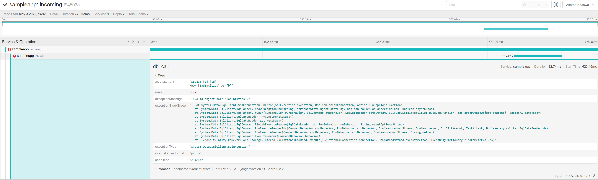
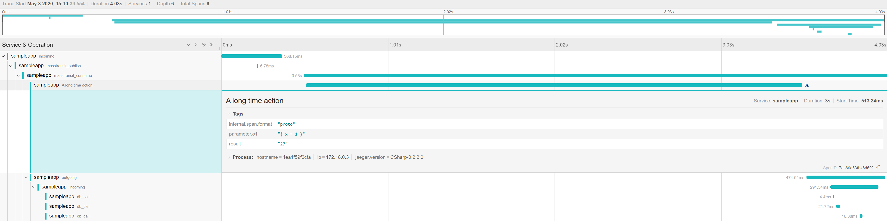

# Inject DevOps-things using ICorProfilerCallback

This project has a goal to demonstrate injection of the following devops-related things into .net core 2.1 apps:
 - Logger configuration
 - Distributed tracing for
    - incoming http requests
    - outgoing http requests
    - publish masstransit messages
    - consume masstransit messages
 - Collect time execution metrics for:
    - incoming http requests
    - outgoing http requests
    - masstransit publish
    - masstransit consume
    - EntityFrameworkCore queries
    - User-defined using MonitorAttribute (see https://github.com/ABaboshin/DotNetCoreProfiler/blob/core-2.1/src/Interception.Attributes/MonitorAttribute.cs)
 - Store collected metrics in:
    - prometheus
    - jaeger
 - Intercept creation of `IServiceProvider` and provide full access to the DI for the injected code

***Limitations***
 - Ref parameters cannot be intercepted
 - Out parameters cannot be intercepted
 - Function with more then 15 (14 in case of an instance methods) cannot be intercepted

## Project structure

### ICorProfilerCallback implementation

See [src/profiler](src/profiler).

### Interceptors

See [src/Interception](src/Interception):
  - `ConfigureServicesBuilderInterceptor` intercept the `Startup.ConfigureServices` call and injects i.e. logger configuration, general tracing configuration, observers
  - `ConfigureBuilderInterceptor` intercepts the `Startup.Configure` call and inject tracing middleware
  - `CreateUsingRabbitMqInterceptor` intercepts the rabbitmq masstransit bus configuration and injects tracing into publishing pipeline
  - `MassTransitConsumerInterceptor` intercepts consuming of masstransit messages in order to handle the tracing
  - `MonitoringInterceptor` finds the usage of `MonitorAttribute` and intercepts the marked calls with measuring execution time, In addition the following monitor parameters can be injected:
      - Customited metric name
      - Passed parameters
      - Return value
      - For usage see https://github.com/ABaboshin/DotNetCoreProfiler/blob/core-2.1/sample/MessageBus/MyMessageConsumer.cs#L42

### Observers

See [src/Interception.Observers](src/Interception.Observers):
  - `EntityFrameworkCoreObserver` observers and measure execution time of entity framework core queries
  - `HttpHandlerDiagnostrics` observers and measure execution time of outgoing http requests

### Prometheus/Statsd reporter

See [src/Interception.OpenTracing.Prometheus](Interception.OpenTracing.Prometheus) is an implementation of OpenTracing to report the metrics into statsd.

### Sample

See [sample](sample).

In order to run the sample execute
```
yarn run:all:21
```

It will create an app running on `http://localhost:5000` with the following endpoints:
 - api/values/bad -> produces one incoming http metric with an error and one entity framework core metric with an error

 - api/values/publish -> produces
    - two incoming http metric
    - one masstransit publish metric
    - one masstransit consume metric
    - one masstransit outgoing http metric
    - three entity framework core metric
    - one custom "A long time action metric" with result and one of the parameters

